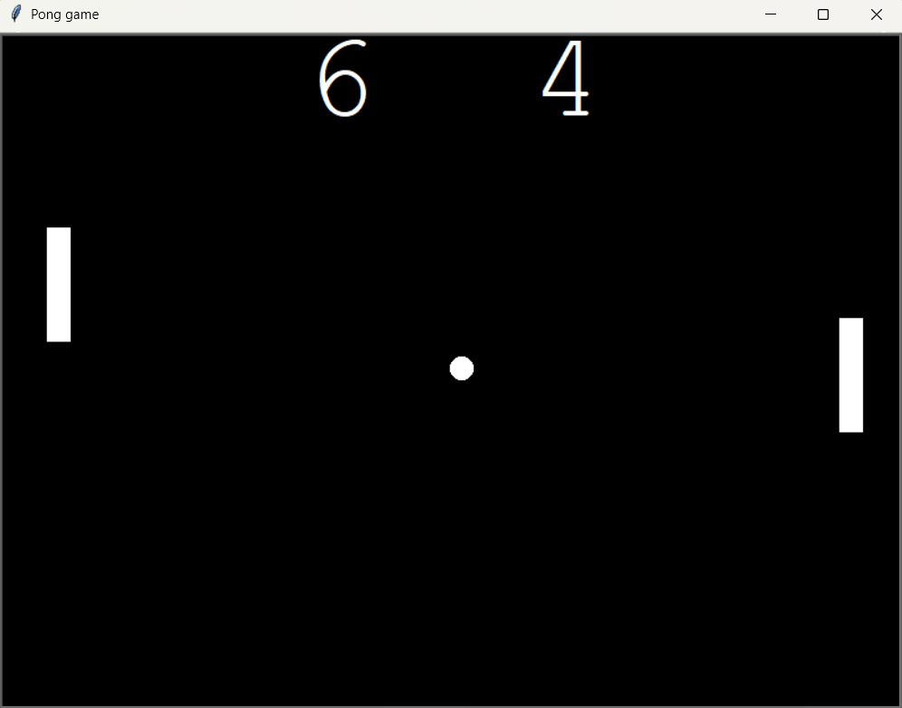

# Pong Game 🏓

A classic Pong game built using Python and the Turtle graphics library.

## Features

- Two-player gameplay
- Paddle controls:
  - Left Paddle: `W` (Up), `S` (Down)
  - Right Paddle: `↑` (Up), `↓` (Down)
- Ball collision detection
- Score tracking
- Increasing ball speed after paddle hits
- Simple and clean Turtle GUI

## Screenshot



## Project Structure

```text
pong-game/
│
├── main.py
├── paddle.py
├── ball.py
├── scoreboard.py
│
├── images/
│   └── pong_game.png
│
├── README.md
└── .gitignore
```

## Requirements

- Python 3.x

No external libraries are required.

The project uses Python's built-in:

- turtle
- time

## How to Run

Clone the repository:

```bash
git clone <your-repository-url>
```

Move into the project directory:

```bash
cd pong-game
```

Run the game:

```bash
python main.py
```

## Controls

| Player | Up | Down |
|----------|----------|----------|
| Left Paddle | W | S |
| Right Paddle | ↑ | ↓ |

## Learning Concepts Used

This project helped practice:

- Object-Oriented Programming (OOP)
- Classes and Objects
- Event Handling
- Collision Detection
- Game Loops
- Python Turtle Graphics
- Modular Code Organization

## Future Improvements

- Single-player mode against AI
- Pause/Resume feature
- Start menu
- Sound effects
- Difficulty levels

## Author

Abhishek Kumar